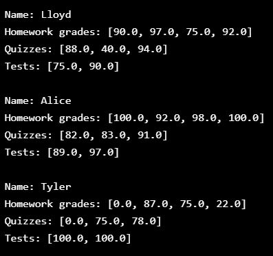
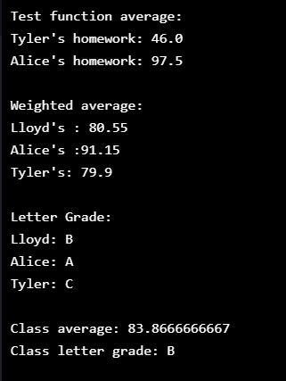

# Student_Becomes_the_Teacher_Py_2
Codecademy's “Challenge Course”. You are the teacher of your own class. Make a gradebook for all of your students and manage your class information.

## General info
The purpose of the project is just personal learning. I may revisit this code to find different solutions or to apply it under other context. 

## Description
  * There are three dictionaries: _lloyd_, _alice_, and _tyler_ for each student. Each dictionary has keys "name", "homework", "quizzes", and "tests".
  
  * A list called _students_ that contains the dictionaries lloyd, alice, and tyler.

  * Function _print_student_record_ prints the information in each student record (tests, quizzes . . . etc. in order). There is also a _print_student_record_unordered_ that just prints the contents of the student dictionary.
  
  

  * **Calculate the average:** function _average_ takes a list of numbers and returns the average. It calls the built-in sum() function with the numbers list as a parameter and stores the result as float() in a variable called total. Then divides total by the length of the numbers list to calculate the average. 

  * **Calculate each student average:** function _get_average_ takes a _student_ dictionary (like lloyd, alice, or tyler) as input and returns his/her weighted average by running the values in each student file (homework, quizzes and tests) through function _average_ and then returning the sum of the value of each of these elements after adjusting their weight in the final grade.

  * function _get_letter_grade_ takes one argument _score_ that is a number and returns a letter score(>90="A", etc). This is done by using a chain of if: / elif: / else: statements.

  * **Get the results of the whole class:** function _get_class_average_ takes one argument _class_list_ that is a list containing the three students. Creates an empty list called results where the averages will be appended. For each student item in the class_list, calculates get_average(student) and then call results.append(). Returns the result of calling average() with results.

## Table of contents
* [General info](#general-info)
* [Description](#description)
* [Technologies](#technologies)
* [Setup](#setup)
* [Status](#status)
* [References](#references)

## Technologies
* Python 2

## Setup
NA - It's only coding examples, there's no setup.

## Status
Project is:  _finished_

## References
Based on Codecademy's _Learn Python 3_ course, _Student Becomes the Teacher_
