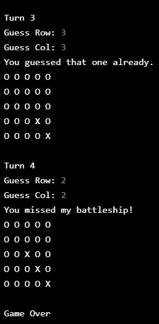

# Exam_Statistics_Py_2
Basic Codecademy practice exercise. You are a teacher. Your students just took their first test. It’s time to see how everyone did. Let’s write a program to compute the mean, variance, and standard deviation of the test scores.

## General info
The purpose of the project is just personal learning. I may revisit this code to find different solutions or to apply it under other context. 

## Description
list _grades_  consist of the student's grades. The data is anonymous to protect the privacy of the students.

function _print_grades_ takes one argument, a list called _grades_input_.  The function iterates through grades_input and print each item on its own line. 

function _grades_sum_  takes in a list of scores named _scores_. It computes the sum of the scores and returns the computed sum. (Without using the built-in _sum_ function).

function _grades_average_ takes a list _grades_input_  as argument. It calls grades_sum with _grades_input_ and computes the average of the grades by dividing that sum by float(len(grades_input)). It returns the average.

function _grades_variance_ accepts one list as argument _scores_. It first creates a variable _average_ and store the result of calling grades_average(scores). Next it creates another variable _variance_ and set it to zero. For each score in scores, it computes its squared difference: (average - score) ** 2 and add that to variance. Finally it divide the total variance by the number of scores and return that value.

The variance allows us to see how widespread the grades were from the average. A very large variance means that the students’ grades were all over the place, while a small variance (relatively close to the average) means that the majority of the students had similar grades.

Standard Deviation: is the square root of the variance. You can calculate the square root by raising the number to the one-half power.

function _grades_std_deviation_ takes one argument called _variance_. It returns  the result of variance ** 0.5

gobal variable called _variance_ stores the result of calling grades_variance(grades). 

#### To-do list:
* For self reference, add a better description for what each meassurement means and how it is applied (std deviation, variance, etc. I always get the mixed up)

## Table of contents
* [General info](#general-info)
* [Description](#description)
* [Screenshots](#screenshots)
* [Technologies](#technologies)
* [Setup](#setup)
* [Status](#status)
* [References](#references)

## Screenshots

## Technologies
* Python 2

## Setup
NA - It's only coding examples, there's no setup.

## Status
Project is: _finished_, - kept for reference.

## References
Based on Codecademy's _Learn Python 2_ course, excersice _EXAM STATISTICS_
